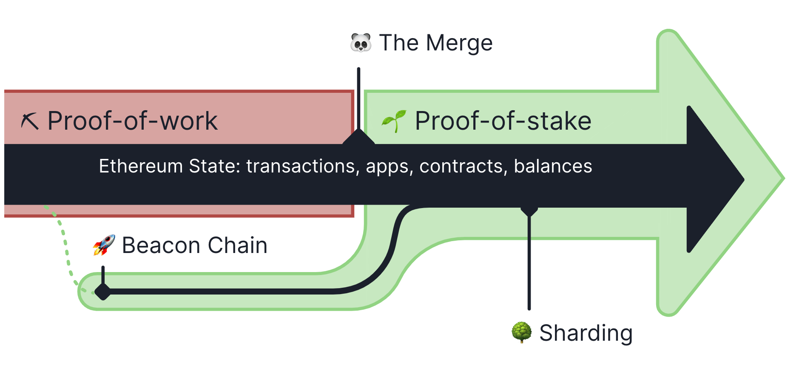

# Tutorials

## About Ethereum merge
The Merge was the joining of the original execution layer of Ethereum (the Mainnet that has existed since genesis) with its new proof-of-stake consensus layer, the Beacon Chain. It eliminated the need for energy-intensive mining and instead enabled the network to be secured using staked ETH. It was a truly exciting step in realizing the Ethereum vision—more scalability, security, and sustainability.



## Software needs to be installed

### Geth (Execution client)

Go-ethereum can be installed with the built images which are downable here: https://geth.ethereum.org/downloads

Detailed installation instructions can be found here: https://geth.ethereum.org/docs/getting-started/installing-geth

A short Intro to Geth: https://geth.ethereum.org/docs/getting-started

### Consensus clients

Geth is an execution client. Historically, an execution client alone was enough to run a full Ethereum node. However, since Ethereum swapped from proof-of-work (PoW) to proof-of-stake (PoS) based consensus, Geth needs to be coupled to another piece of software called a "consensus client".

Intro link to consensus clients: https://geth.ethereum.org/docs/getting-started/consensus-clients

There are currently five consensus clients that can be run alongside Geth. These are:

- [Lighthouse](https://lighthouse-book.sigmaprime.io/): written in Rust
- [Nimbus](https://nimbus.team/): written in Nim
- [Prysm](https://docs.prylabs.network/docs/getting-started): written in Go
- [Teku](https://consensys.io/teku/): written in Java
- [Lodestar](https://lodestar.chainsafe.io/): written in Typescript

In this tutorial we will work with **Lighthouse** consensus client.

### Clef (Account manager)

Intro to Clef: https://geth.ethereum.org/docs/tools/clef/introduction

Geth uses an external signer called Clef to manage accounts. This is a standalone piece of software that runs independently of - but connects to - a Geth instance. Clef handles account creation, key management and signing transactions/data.

Clef comes bundled with Geth and can be built along with Geth and the other bundled tools using:

```shell
make all
```

However, Clef is not bound to Geth and can be built on its own using:

```shell
make clef
```

Once built, Clef must be initialized. This includes storing some data, some of which is sensitive (such as passwords, account data, signing rules etc). Initializing Clef takes that data and encrypts it using a user-defined password.

```shell
clef init
```

